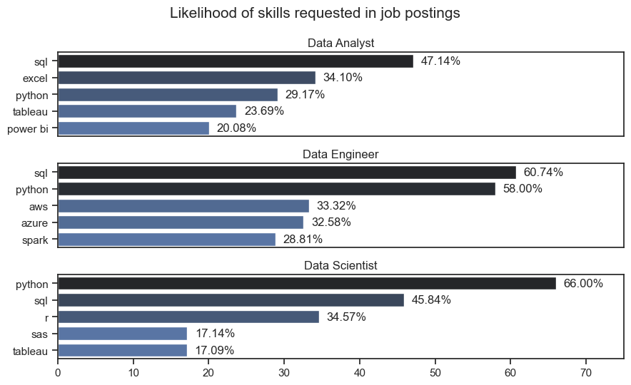

# 💡 Most Demanded Skills for Data Roles — Job Data Analysis

**Project:** Job Data Analysis (Python)  
**Phase:** Skill Demand Analysis  
**Objective:** Identify which technical skills are most frequently requested across different data-related job roles — *Data Analyst*, *Data Engineer*, and *Data Scientist.*

---

## 📊 Overview
This part of the analysis looks at the **likelihood of various skills appearing in job postings** for each major data role.  
It helps understand what tools and technologies employers value most, allowing professionals to focus on skills with the highest market demand.

---

## 🖼️ Visualization



*Figure: Skill demand visualization across Data Analyst, Data Engineer, and Data Scientist roles.*

---
## 📈 Key Insights

### 1️⃣ Data Analyst
**File:** `likelihood_of_skill_requested_in_job_postings.png` (Top section)

- **SQL** is the most requested skill (47%), followed by **Excel (34%)** and **Python (29%)**.  
- Visualization tools like **Tableau (23%)** and **Power BI (20%)** also appear frequently.  

💡 *Insight:* Employers expect strong SQL and Excel proficiency for data analysts, with Python and BI tools becoming increasingly important.

---

### 2️⃣ Data Engineer
**File:** `likelihood_of_skill_requested_in_job_postings.png` (Middle section)

- **SQL (60%)** and **Python (58%)** are core skills across nearly all data engineering roles.  
- Cloud and big data tools like **AWS (33%)**, **Azure (32%)**, and **Spark (29%)** are also highly valued.  

💡 *Insight:* Modern data engineering requires both coding and cloud expertise — SQL and Python remain the base, while AWS and Azure add strong employability advantages.

---

### 3️⃣ Data Scientist
**File:** `likelihood_of_skill_requested_in_job_postings.png` (Bottom section)

- **Python** dominates (66%), making it the top skill for data science roles.  
- **SQL (46%)** and **R (35%)** are also key.  
- **SAS (17%)** and **Tableau (17%)** appear in niche roles requiring statistical analysis and reporting.  

💡 *Insight:* Python has become the universal language for data science. However, complementary skills like SQL and R remain essential for database work and statistical modeling.

---

## 📂 Folder Structure
```
/2.Most_Demanded_Skills_for_Data_Roles
├── likelihood_of_skill_requested_in_job_postings.png
├── 2.Most_Demanded_Skills_for_Data_Roles.ipynb
└── README.md
```


---

## 🧾 Summary

| Role | Top Skills | Key Takeaway |
|------|-------------|--------------|
| **Data Analyst** | SQL, Excel, Python, Tableau | Strong focus on data handling and reporting |
| **Data Engineer** | SQL, Python, AWS, Azure | High demand for cloud and big data skills |
| **Data Scientist** | Python, SQL, R | Python dominates, supported by statistical tools |

---

## 🏁 Conclusion
Across all roles, **Python and SQL** consistently appear as must-have skills.  
For engineers, **cloud platforms** like AWS and Azure are becoming essential, while analysts benefit from **Excel and BI tools**.  
This analysis clearly shows that mastering a **core combination of SQL, Python, and visualization tools** provides strong career flexibility across data fields.

---

**📌 Author:** Utkarsh Naik  
**📈 Project Type:** Job Market & Skill Demand Analysis (Python)
