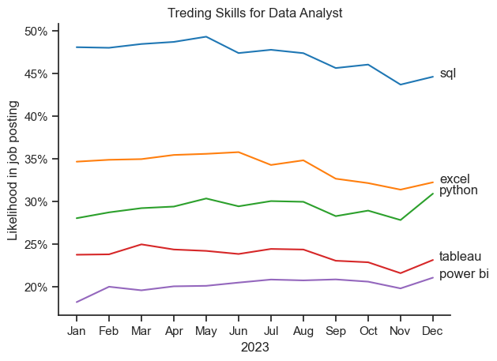

# 📈 Skills Trend — Job Data Analysis

**Project:** Job Data Analysis (Python)  
**Phase:** Skills Trend Analysis  
**Objective:** To track how the demand for specific Data Analyst skills has changed over time in 2023.

---

## 📊 Overview
This part of the analysis focuses on the **monthly trend of technical skills** mentioned in job postings for Data Analyst roles.  
By visualizing skill frequencies throughout the year, we can identify which tools and technologies maintained consistent demand and which ones showed fluctuations.

---
## 🖼️ Visualization



*Figure: Skill demand visualization across months.*

---

## 🧠 Key Insights

**File:** `trending_skills_for_data_analyst.png`

- **SQL** remains the most in-demand skill across all months, consistently appearing in nearly **45–50%** of postings.  
- **Excel** holds a steady position around **35%**, showing its continued relevance in reporting and analytics work.  
- **Python** demand gradually increased toward the end of the year, catching up with Excel in December.  
- **Tableau** and **Power BI** stayed lower (20–25%), but showed minor growth in the second half of the year.  

💡 *Insight:* Employers continue to prioritize **SQL and Excel** for data analysts, but **Python** is clearly becoming more prominent, reflecting a shift toward automation and programming-based analytics.

---

## 📂 Folder Structure
```
/3.Skills_Trend
├── trending_skills_for_data_analyst.png
├── 3.Skills_trend.ipynb
└── README.md
```

---

## 🧾 Summary of Skill Trends

| Skill | 2023 Trend Summary | Remarks |
|-------|--------------------|----------|
| **SQL** | Consistently high demand (~48%) | Core requirement for data handling |
| **Excel** | Stable demand (~35%) | Still a key business analysis tool |
| **Python** | Gradual upward trend | Increasing adoption in analytics |
| **Tableau** | Slight dip mid-year, minor recovery | Steady BI visualization tool |
| **Power BI** | Lowest but growing steadily | Growing interest toward year-end |

---

## 🏁 Conclusion
Throughout 2023, **SQL and Excel** continued to dominate job postings for data analysts.  
However, **Python** showed a noticeable rise, signaling its growing importance in analytical workflows.  
Visualization tools like **Tableau** and **Power BI** remain valuable complementary skills, especially for reporting and dashboard development.

---

**📌 Author:** Utkarsh Naik  
**📈 Project Type:** Job Market & Skills Trend Analysis (Python)