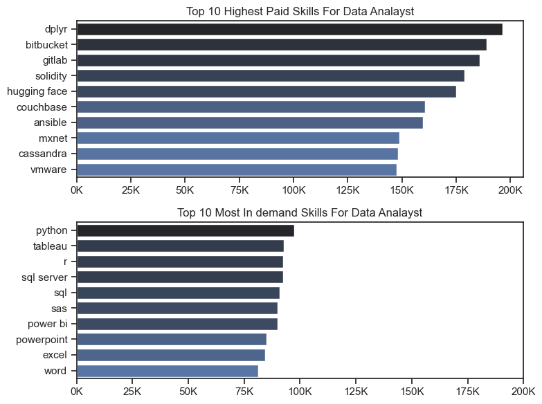
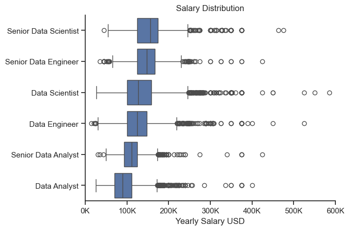

# 💰 Salary Analysis — Job Data Analysis

**Project:** Job Data Analysis (Python)  
**Phase:** Salary Analysis  
**Objective:** Explore salary patterns across data-related roles and identify the highest-paying and most in-demand skills for Data Analysts.

---

## 📊 Overview
This part of the project focuses on understanding **salary distribution** among data professionals and identifying **skills that influence earning potential**.  
It also highlights which technical skills are most in-demand in the job market versus those that yield the highest salaries.

---
## 🖼️ Visualization

  

*Figure: highest paid skills and top-in demand skills.*



*Figure: Skill demand visualization across Data Analyst, Data Engineer, and Data Scientist roles.*

---

## 🧾 Key Insights

### 1️⃣ Salary Distribution by Role
**File:** `salary_distribution.png`

- **Senior roles** (Data Scientist, Data Engineer) show higher median salaries and greater variation due to diverse experience levels.  
- **Senior Data Scientist** has the **highest median salary**, often exceeding **$200K**.  
- **Data Analyst** and **Senior Data Analyst** positions have a tighter range, with most salaries between **$70K–$130K**.  

💡 *Insight:* Salary growth strongly correlates with role seniority and specialization. The pay gap between analyst and scientist/engineer roles reflects the skill depth and technical expertise required.

---

### 2️⃣ Highest Paid vs Most In-Demand Skills
**File:** `highest_paid_skills_&_top_in-demand_skills.png`

#### 🔹 Top 10 Highest-Paid Skills
- **dplyr**, **Bitbucket**, and **GitLab** top the list with average salaries around **$190K–$200K**.  
- Other high-paying technologies include **Solidity**, **Hugging Face**, and **Couchbase**, reflecting growing niches in **AI**, **blockchain**, and **DevOps**.

💼 *Insight:* Specialized tools in machine learning, data pipelines, and software collaboration bring higher pay, even if less frequently mentioned in postings.

#### 🔹 Top 10 Most In-Demand Skills
- **Python**, **Tableau**, and **R** lead demand, followed by **SQL** and **Power BI**.  
- Business tools like **Excel**, **Word**, and **PowerPoint** also appear, showing a blend of technical and communication skills in analytics jobs.

📈 *Insight:* While Python and visualization tools are most requested, the highest-paying skills tend to be in more **niche or technical areas** like MLOps, version control, or cloud frameworks.

---

## 📂 Folder Structure
```
/4.Salary_Analysis
├── salary_distribution.png
├── highest_paid_skills_&_top_in-demand_skills.png
├── 4.Salary_Analysis.ipynb
└── README.md
```

---

## 🧩 Summary

| Aspect | Key Observation |
|--------|-----------------|
| 💼 **Top Salary Roles** | Senior Data Scientist & Senior Data Engineer lead earnings |
| 🧠 **Skill Pay Gap** | Advanced tools (GitLab, Hugging Face) pay far more than general skills |
| 📊 **In-Demand Skills** | Python, Tableau, SQL remain market staples |
| 💡 **Overall Trend** | Specialized tech → higher pay; general skills → more demand |

---

## 🏁 Conclusion
The analysis shows that while **Python, SQL, and Tableau** are essential for employability, the **highest-paying opportunities** lie in mastering **advanced frameworks and specialized tools** like GitLab, Couchbase, or cloud-based technologies.  
Building expertise in **machine learning infrastructure and data engineering tools** provides the best long-term growth potential.

---

**📌 Author:** Utkarsh Naik  
**📈 Project Type:** Salary & Skill Market Analysis (Python)