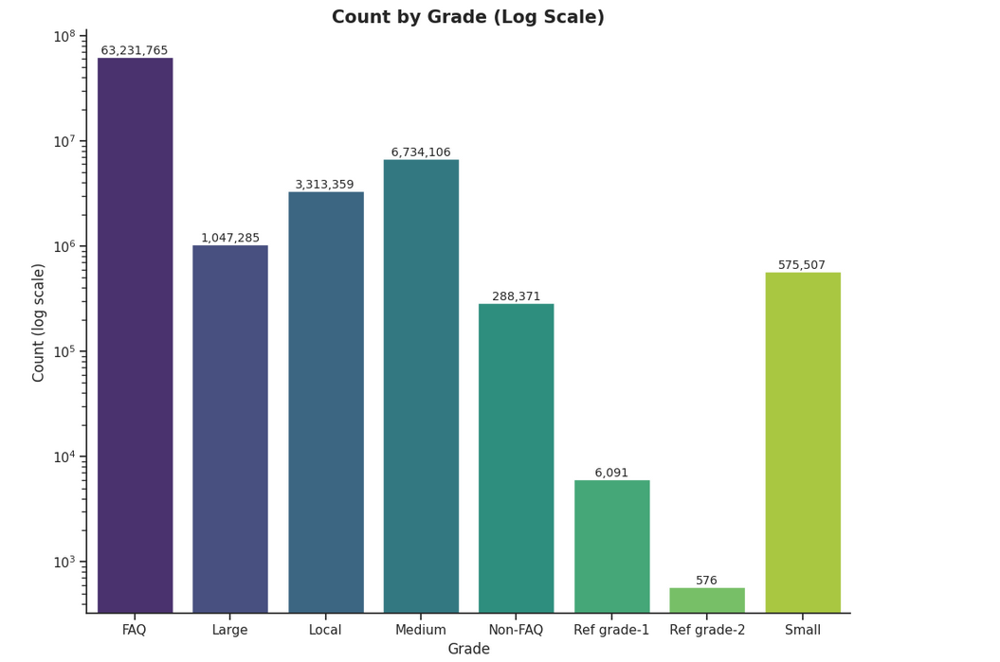

# 📊 Commodity Price & Market Trends in India (2001–2025)

A comprehensive analysis of **75+ million records** of agricultural market data from India (2001–2025).  
This project explores **price dynamics, trade volume, and seasonal patterns** of major commodities using Python, Pandas, and Seaborn.

---
## 📘 Project Links

- 🧠 **Kaggle Project:** [Daily Market Prices of Commodity (India 2001–2025)](https://www.kaggle.com/code/utkarsh1093/daily-market-prices-of-commodity-india-2001-2025)  
- 📂 **Data Source:** [Daily Commodity Prices India Dataset](https://www.kaggle.com/datasets/khandelwalmanas/daily-commodity-prices-india/data?select=parquet)  

---

## 🧠 Project Overview

The Indian agricultural market experiences constant price variation due to changes in climate, production, and regional supply-demand balance.  
This analysis aims to uncover **trends, seasonal fluctuations, and trade dominance** across commodities, states, and years.

---

## 🗂️ Dataset Details

- **Source:** [Kaggle - Daily Market Prices of Commodity (India 2001–2025)](https://www.kaggle.com/)  
- **Format:** `.parquet` (merged from 25 CSV files)  
- **Rows:** 75,195,485  
- **Columns:** 11  
- **Duration:** January 2001 – December 2025  

| Column | Description |
|:--------|:-------------|
| `State` | Indian state name |
| `District` | Market district |
| `Market` | Local market name |
| `Commodity` | Type of commodity traded |
| `Variety` | Commodity variety |
| `Grade` | Commodity grade or quality |
| `Arrival_Date` | Date of record |
| `Min_Price`, `Max_Price`, `Modal_Price` | Daily price range (₹) |
| `Commodity_Code` | Unique commodity identifier |

---

## 🧰 Tools & Libraries Used

- **Python 3**
- **Pandas** — data wrangling & transformation  
- **Seaborn / Matplotlib** — data visualization  
- **NumPy** — numerical operations  
- **Jupyter / Kaggle Notebook** — experimentation environment  

---

## 🔍 Analysis Workflow

1. **Data Preparation**
   - Merged 25 CSVs (2001–2025)  
   - Handled nulls, converted `Arrival_Date` → datetime  
   - Extracted `year` and `month` columns  
   - Used median aggregation for price-based comparisons  

2. **Exploratory Data Analysis (EDA)**
   - Yearly price trends  
   - Distribution across commodities  
   - Trade volume by grade and state  
   - Seasonal patterns  
   - Min–Max price comparison  

3. **Visualization**
   - Line plots for yearly growth  
   - Boxplots for price distribution  
   - Heatmaps for month–commodity analysis  
   - Horizontal bar charts for state-based trends  
   - Pie chart for market share  

---
## 📈 Key Visuals

### 🔹 Price Trends Over Time
Shows the upward trend in commodity prices since 2001, with visible growth after 2015.  

---

### 🔹 Modal Price Year-over-Year
Displays how the median modal price has evolved annually, highlighting consistent market growth.  

---

### 🔹 Top Commodity per Year
Shows the most frequently traded commodity each year, capturing dominance changes over time.  

---

### 🔹 Price Distribution by Commodity
Displays median price variation and outlier range across top 10 commodities.  

---

### 🔹 Minimum and Maximum Price Distributions
Visualizes the spread between minimum and maximum recorded prices across commodities.  

---

### 🔹 Commodity Quality Analysis
Breakdown of commodity grades (e.g., FAQ, Standard) and their distribution in trade.  

---

### 🔹 Market Share Pie Chart
Represents the top 7 states contributing the most to total market trade volume.  

---

### 🔹 Top Commodity by State
Identifies leading commodities by trade volume in each Indian state.  

---

### 🔹 Top Traded Commodities of All Time
Highlights **Paddy (Dhan)**, **Wheat**, and **Potato** as the most traded items nationwide.  

---

### 🔹 Median Commodity Price by Month
Shows monthly variation in prices — clear rise between **June to October**.  

---

### 🔹 Modal Price by State
Reveals highest median prices in **Andaman & Nicobar** and **Goa**.  

---

### 🔹 Seasonal Price Heatmap
Reveals how certain commodities (like Mustard and Green Chilli) peak between **July–October**.  

---

## 💡 Key Insights

| # | Insight |
|---|----------|
| 1️⃣ | **Wheat, Paddy, and Potato** dominate trade volumes across India, together covering more than 50% of transactions. |
| 2️⃣ | The **median modal price** has shown steady growth, rising from ₹750 in 2001 to ₹3500+ by 2025. |
| 3️⃣ | **Andaman & Nicobar**, **Goa**, and **Mizoram** consistently record the highest average prices. |
| 4️⃣ | Prices typically **peak from July to October**, coinciding with the post-harvest and festival seasons. |
| 5️⃣ | The **FAQ grade** accounts for over 80% of all trades, showing strong preference for standard quality produce. |
| 6️⃣ | Commodities like **Mustard** and **Green Chilli** show strong seasonal price sensitivity. |
| 7️⃣ | Overall, trade activity has scaled significantly since 2008, with more states contributing to national supply. |

---

## 📊 Observations Summary

- Indian agri-markets show **stable long-term price inflation**, reflecting higher MSP and transport costs.  
- **Median** is used over mean to minimize outlier skew.  
- Seasonal and commodity diversity reflects **India’s varied climate zones** and **crop cycles**.  
- This data can inform **market prediction models**, **policy decisions**, and **farmer advisories**.

---

## 👨‍💻 Author

**Utkarsh Naik**  
- Data Analyst 
- Contact : utkarshnaik.in@gmail.com  
- 💼 Passionate about leveraging AI and data-driven insights for real-world impact.  
---

### ⭐ If you found this project insightful, don’t forget to **Star** the repository on GitHub!

